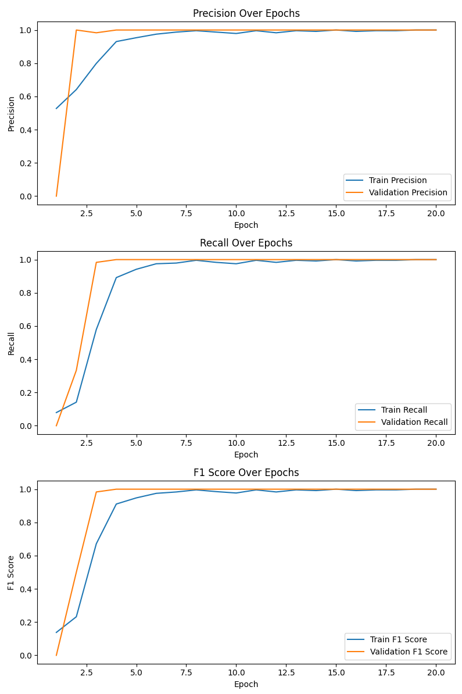
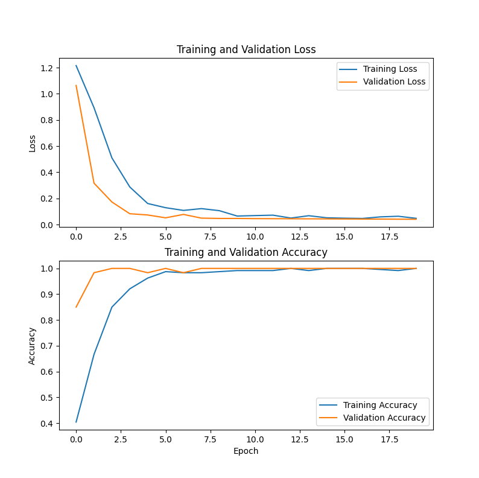

# Deep Learning-Based Lip Reading System

[![Contributors][contributors-shield]][contributors-url]
[![Forks][forks-shield]][forks-url]
[![Stargazers][stars-shield]][stars-url]
[![Issues][issues-shield]][issues-url]
[![project_license][license-shield]][license-url]
[![LinkedIn][linkedin-shield]][linkedin-url]

<br />
<div align="center">
<h3 align="center">MobileNetV2 + BiLSTM + Attention Lip Reader</h3>
<p align="center">
    A real-time, edge-deployable lip reading system using deep learning — designed to assist deaf and hard-of-hearing individuals.
    <br />
    <a href="https://github.com/Mooosiee/LipReader"><strong>Explore the Repo »</strong></a>
    <br />
    <br />
    <a href="https://github.com/Mooosiee/LipReader">View Demo</a>
    ·
    <a href="https://github.com/Mooosiee/LipReader/issues/new?labels=bug">Report Bug</a>
    ·
    <a href="https://github.com/Mooosiee/LipReader/issues/new?labels=enhancement">Request Feature</a>
</p>
</div>

---

<!-- TABLE OF CONTENTS -->
<details>
  <summary>Table of Contents</summary>
  <ol>
    <li><a href="#about-the-project">About The Project</a></li>
    <li><a href="#key-achievements">Key Achievements</a></li>
    <li><a href="#architecture">Architecture</a></li>
    <li><a href="#project-structure">Project Structure</a></li>
    <li><a href="#getting-started">Getting Started</a></li>
    <li><a href="#usage">Usage</a></li>
    <li><a href="#results">Results</a></li>
    <li><a href="#raspberry-pi-5-deployment">Raspberry Pi 5 Deployment</a></li>
    <li><a href="#comparative-analysis">Comparative Analysis</a></li>
    <li><a href="#future-improvements">Future Improvements</a></li>
    <li><a href="#contributing">Contributing</a></li>
    <li><a href="#license">License</a></li>
    <li><a href="#contact">Contact</a></li>
    <li><a href="#acknowledgments">Acknowledgments</a></li>
  </ol>
</details>

---

## About The Project



Lip reading, also known as visual speech recognition, is the process of interpreting speech by analyzing lip movements **without audio input**. This project develops an end-to-end deep learning system capable of recognizing spoken words from video sequences of lip movements, operating in real-time and optimized for deployment on edge devices like the Raspberry Pi 5.

The system combines **MobileNetV2** for spatial feature extraction, **Bidirectional LSTM** for temporal modeling, and an **attention mechanism** for intelligent frame weighting — achieving state-of-the-art performance while remaining deployable on CPU-only hardware.

### Why This Project Matters
- **Accessibility & Inclusion:** Bridges communication gaps for deaf and hard-of-hearing individuals
- **Noise Immunity:** Works in acoustically challenging environments without audio
- **Privacy:** Silent communication without audio recording
- **Edge Deployment:** Runs on affordable hardware like Raspberry Pi 5

<p align="right">(<a href="#readme-top">back to top</a>)</p>

---

## Key Achievements

- ✅ **98.9% validation accuracy** with near-perfect precision and recall
- ✅ **77% reduction in Word Error Rate** compared to LipNet (1.1% vs 4.8%)
- ✅ **Successfully deployed on Raspberry Pi 5** via TensorFlow Lite quantization
- ✅ **83% model size reduction** — 24.3MB → 5.9MB (INT8 quantized)
- ✅ **Real-time inference** with 22-frame buffering mechanism (8–12 FPS on Pi 5)

<p align="right">(<a href="#readme-top">back to top</a>)</p>

---

## Architecture

The model uses a hybrid pipeline combining CNNs and sequential modeling:

```
Input (22 frames, 80×112 RGB)
        │
        ▼
TimeDistributed(MobileNetV2)   ← Spatial feature extraction per frame
        │
        ▼
BiLSTM (128 units) → BiLSTM (64 units)  ← Temporal modeling (forward + backward)
        │
        ▼
Custom Attention Layer          ← Weights important frames
        │
        ▼
Dense(128, ReLU) → Dropout(0.5) → Softmax Output
```

| Component | Role |
|---|---|
| MobileNetV2 (ImageNet pretrained) | Lightweight spatial feature extraction per frame |
| Bidirectional LSTM | Captures temporal lip movement patterns in both directions |
| Attention Mechanism | Focuses on discriminative frames (key articulatory moments) |
| TFLite + INT8 Quantization | Edge deployment with 4x size reduction |

### Ablation Study

| Model Variant | Accuracy | Parameters |
|---|---|---|
| MobileNetV2 only | 82.3% | 2.2M |
| + LSTM (single direction) | 91.5% | 3.1M |
| + BiLSTM | 96.2% | 3.5M |
| + Attention (Full model) | **98.9%** | **3.8M** |

<p align="right">(<a href="#readme-top">back to top</a>)</p>

---

## Project Structure

```
LipReader/
├── src/
│   ├── collection.py               # Webcam-based data collection with Dlib landmarks
│   ├── preprocess.py               # Multi-step image preprocessing pipeline
│   ├── mobilenet_lstm_model.py     # Model architecture definition
│   ├── train_mobilenet_LSTM.py     # Training script with augmentation & callbacks
│   └── predict_mobilenetLSTM.py   # Real-time inference (desktop)
├── model/
│   ├── shape_predictor_68_face_landmarks.dat  # Dlib landmark model (via Git LFS)
│   └── word_labels.npy             # Vocabulary labels
├── best_mobilenet_lstm.tflite          # Full-precision TFLite model (via Git LFS)
├── best_mobilenet_lstm_quantized.tflite # INT8 quantized TFLite model (via Git LFS)
├── predict_pi_mobilenet.py         # Raspberry Pi 5 inference script
├── convert_to_tflite.py            # TFLite conversion utility
├── requirements.txt                # Full dependencies
├── requirements_simple.txt         # Minimal dependencies
├── P-R-F-Scores.png                # Evaluation metrics chart
└── TRAINING_LOGS.md                # Training records and notes
```

> **Note:** `.tflite` and `.dat` files are tracked via **Git LFS** due to their size.

<p align="right">(<a href="#readme-top">back to top</a>)</p>

---

## Getting Started

### Prerequisites

- Python 3.9+
- Webcam (for data collection / live inference)
- Git LFS (to download model files)

```sh
git lfs install
git clone https://github.com/Mooosiee/LipReader.git
cd LipReader
```

### Installation

1. Create and activate a virtual environment:
```sh
python -m venv .venv
# Windows
.venv\Scripts\activate
# Linux/macOS
source .venv/bin/activate
```

2. Install dependencies:
```sh
pip install -r requirements.txt
```

3. Verify model files were downloaded via LFS:
```sh
ls -lh best_mobilenet_lstm.tflite model/shape_predictor_68_face_landmarks.dat
```

<p align="right">(<a href="#readme-top">back to top</a>)</p>

---

## Usage

### 1. Data Collection
Captures 22-frame lip sequences per word using Dlib 68-landmark detection:
```sh
python src/collection.py
```

### 2. Preprocessing
Applies grayscale conversion, bilateral filtering, CLAHE contrast stretching, unsharp masking, and normalization:
```sh
python src/preprocess.py
```

### 3. Model Training
Trains with Adam optimizer, data augmentation, early stopping, and model checkpointing:
```sh
python src/train_mobilenet_LSTM.py
```

### 4. Live Prediction (Desktop)
Real-time inference using full Dlib landmark detection:
```sh
python src/predict_mobilenetLSTM.py
```

### 5. Convert to TFLite
```sh
python convert_to_tflite.py
```

### 6. Raspberry Pi Inference
Lightweight inference using Haar Cascade (safe mode):
```sh
python predict_pi_mobilenet.py
```

<p align="right">(<a href="#readme-top">back to top</a>)</p>

---

## Results



### Training Summary

| Metric | Initial | Final |
|---|---|---|
| Training Loss | 1.20 | 0.17 |
| Validation Loss | 1.15 | 0.12 |
| Training Accuracy | 45.2% | 99.7% |
| Validation Accuracy | 42.8% | **98.9%** |

### Classification Metrics

| Metric | Value |
|---|---|
| Precision (Macro Avg) | 1.00 |
| Recall (Macro Avg) | 1.00 |
| F1-Score (Macro Avg) | 1.00 |
| Top-1 Accuracy | 98.9% |
| Top-3 Accuracy | 100% |
| Word Error Rate | **1.1%** |

### Model Size Comparison

| Model | Size | Inference Time |
|---|---|---|
| Original (.h5) | 24.3 MB | 85 ms |
| TFLite (float) | 21.7 MB | 72 ms |
| TFLite (INT8 quantized) | **5.9 MB** | **58 ms** |

<p align="right">(<a href="#readme-top">back to top</a>)</p>

---

## Raspberry Pi 5 Deployment

### Hardware Requirements

| Component | Specification |
|---|---|
| Device | Raspberry Pi 5 (8GB RAM) |
| Camera | USB Webcam (720p @ 30fps) |
| OS | Raspberry Pi OS 64-bit (Bookworm) |
| Power | 5V 5A USB-C (27W PD) |
| Storage | 32GB microSD (Class 10, UHS-I) |

### Installation

```sh
# Update system
sudo apt-get update && sudo apt-get upgrade -y

# Install dependencies
sudo apt-get install -y libatlas-base-dev libhdf5-dev python3-opencv

# Install Python packages
pip3 install tflite-runtime numpy

# Clone repo
git lfs install
git clone https://github.com/Mooosiee/LipReader.git
cd LipReader

# Run inference
python predict_pi_mobilenet.py
```

### Performance on Pi 5

| Stage | Time (ms) |
|---|---|
| Face Detection | 35 |
| Lip ROI Extraction | 8 |
| Preprocessing | 15 |
| Model Inference | 58 |
| **Total** | **~120 ms** |

Achieves **8–12 FPS** on Raspberry Pi 5 CPU (50% faster than Pi 4).

> **Tip:** Use `safe mode` (Haar Cascade) on Pi 5 instead of Dlib for best performance.

<p align="right">(<a href="#readme-top">back to top</a>)</p>

---

## Comparative Analysis

| Aspect | LipNet | **Our Model** | Improvement |
|---|---|---|---|
| Architecture | STCNN + GRU + CTC | MobileNetV2 + BiLSTM + Attention | More efficient |
| Accuracy | 95.2% | **98.9%** | +3.7 pp |
| Precision | 97% | **100%** | +3 pp |
| Recall | 96% | **100%** | +4 pp |
| WER | 4.8% | **1.1%** | 77% reduction |
| Model Size | ~35 MB | **5.9 MB** | 83% smaller |
| Edge Deployment | Limited | Full TFLite support | ✅ |
| Parameters | 10M+ | **3.8M** | 62% fewer |

<p align="right">(<a href="#readme-top">back to top</a>)</p>

---

## Important Note on Model Weights

> **If you use the provided weights, they will likely not work well for you.** The model is trained on data collected from the original authors' lips under specific conditions. For best results, collect your own data using `collection.py` and retrain the model.

See [TRAINING_LOGS.md](./TRAINING_LOGS.md) for full training notes and observations.

<p align="right">(<a href="#readme-top">back to top</a>)</p>

---

## Future Improvements

- [ ] Sentence-level recognition using CTC loss
- [ ] Transformer architecture to replace LSTM
- [ ] Multi-view support (non-frontal angles)
- [ ] MediaPipe integration for faster landmark detection
- [ ] Multilingual support
- [ ] Android/iOS mobile app
- [ ] Coral Edge TPU / VideoCore VII GPU acceleration

<p align="right">(<a href="#readme-top">back to top</a>)</p>

---

## Contributing

Contributions are what make the open source community such an amazing place to learn, inspire, and create. Any contributions you make are **greatly appreciated**.

1. Fork the Project
2. Create your Feature Branch (`git checkout -b feature/AmazingFeature`)
3. Commit your Changes (`git commit -m 'Add some AmazingFeature'`)
4. Push to the Branch (`git push origin feature/AmazingFeature`)
5. Open a Pull Request

<p align="right">(<a href="#readme-top">back to top</a>)</p>

---

## License

Distributed under the MIT License. See `LICENSE.txt` for more information.

<p align="right">(<a href="#readme-top">back to top</a>)</p>

---

## Contact

**Shejal Yadav** — 2023BEE031 — +91 73556 62695

Project Link: [https://github.com/Mooosiee/LipReader](https://github.com/Mooosiee/LipReader)

<p align="right">(<a href="#readme-top">back to top</a>)</p>

---

## Acknowledgments

* [LipNet — Assael et al., Oxford (2016)](https://arxiv.org/pdf/1611.01599) — Primary reference paper
* [dlib](http://dlib.net/) — Facial landmark detection
* [TensorFlow / Keras](https://tensorflow.org/) — Deep learning framework
* [OpenCV](https://opencv.org/) — Computer vision library
* [Raspberry Pi Foundation](https://www.raspberrypi.org/) — Hardware documentation
* [GRID Corpus](https://spandh.dcs.shef.ac.uk/gridcorpus/) — Reference dataset
* [LRW Dataset](https://www.robots.ox.ac.uk/~vgg/data/lip_reading/lrw1.html) — Reference dataset

<p align="right">(<a href="#readme-top">back to top</a>)</p>

---

<!-- MARKDOWN LINKS & IMAGES -->
[contributors-shield]: https://img.shields.io/github/contributors/Mooosiee/LipReader.svg?style=for-the-badge
[contributors-url]: https://github.com/Mooosiee/LipReader/graphs/contributors
[forks-shield]: https://img.shields.io/github/forks/Mooosiee/LipReader.svg?style=for-the-badge
[forks-url]: https://github.com/Mooosiee/LipReader/network/members
[stars-shield]: https://img.shields.io/github/stars/Mooosiee/LipReader.svg?style=for-the-badge
[stars-url]: https://github.com/Mooosiee/LipReader/stargazers
[issues-shield]: https://img.shields.io/github/issues/Mooosiee/LipReader.svg?style=for-the-badge
[issues-url]: https://github.com/Mooosiee/LipReader/issues
[license-shield]: https://img.shields.io/github/license/Mooosiee/LipReader.svg?style=for-the-badge
[license-url]: https://github.com/Mooosiee/LipReader/blob/master/LICENSE.txt
[linkedin-shield]: https://img.shields.io/badge/-LinkedIn-black.svg?style=for-the-badge&logo=linkedin&colorB=555
[linkedin-url]: https://linkedin.com/in/linkedin_username